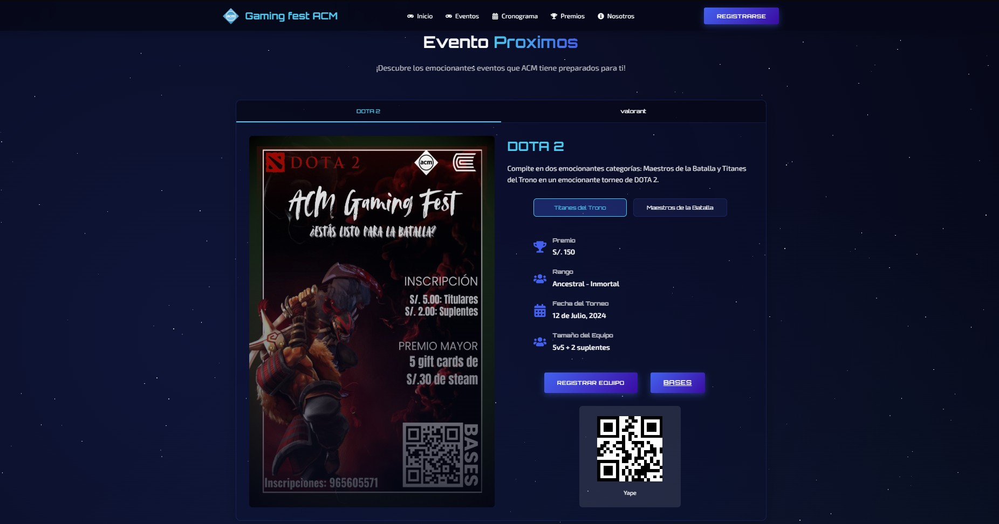
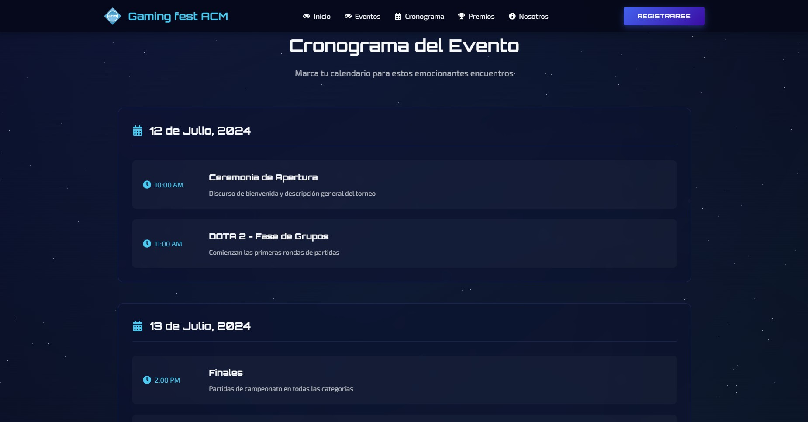
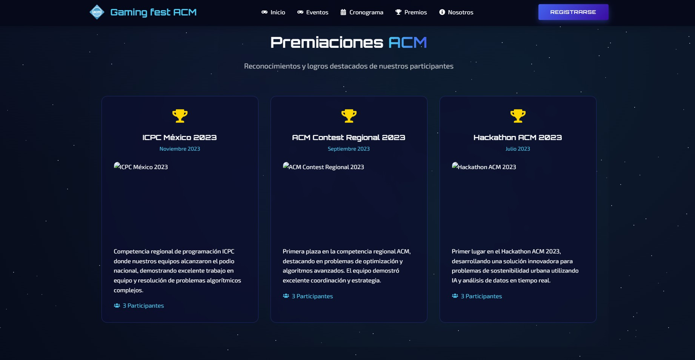

# Sitio Web ACM Gaming Fest 🎮
Banner ACM Gaming

## 👥 Sobre Nosotros

ACM Continental es un capítulo estudiantil dedicado a promover la tecnología e innovación en la Universidad Continental. Nuestra división de gaming se enfoca en crear experiencias competitivas atractivas para estudiantes mientras fomenta el desarrollo profesional.

### Conéctate con Nosotros
- 🎥 [YouTube](https://youtube.com/@acmcontinental-sistemas)
- 📸 [Instagram](https://www.instagram.com/acmsistemas2)
- 🎵 [TikTok](https://www.tiktok.com/@acmconti)
- 💻 [GitHub](https://github.com/ACMContinental)

## 🎮 Estructura del Proyecto
```plaintext
Web Gaming
├───public
│   └───imagenes
└───src
    ├───assets
    ├───components
    │   ├───common
    │   ├───layout
    │   │   ├───Footer
    │   │   └───Navbar
    │   └───sections
    │       ├───About
    │       ├───Games
    │       ├───Hero
    │       ├───Premios
    │       └───Schedule
    └───data
        ├───Games
        ├───Hero
        ├───Premios
        └───Schedule
```

## 📸 Vistas Previas

> Capturas de pantalla del proyecto:

1. 
   *Sección principal con tema cósmico*

2. 
   *Muestra los próximos eventos de ACM*

3. 
   *Interfaz de cronograma de eventos*

4. 
   *Premiaciones de los integrantes de ACM*

## 🛠 Technical Stack

- **Frontend**: React.js
- **Styling**: CSS3 with custom animations
- **Icons**: React Icons
- **Deployment**: [Platform details]

## 🔧 Setup and Installation

1. Clone the repository:
```bash
git clone https://github.com/UmbraFlare-code/web-gaming.git
```
2. Install dependencies:
```bash
npm install
```
## 🤝 Contributing
We welcome contributions from the ACM community! Please follow these steps:

1. Fork the repository
2. Create your feature branch
3. Commit your changes
4. Push to the branch
5. Create a Pull Request
## 📞 Contact
For more information about the tournament or technical support:

- 🎥 [YouTube](https://youtube.com/@acmcontinental-sistemas) - ACM Continental Sistemas
- 📸 [Instagram](https://www.instagram.com/acmsistemas2) - ACM Sistemas
- 🎵 [TikTok](https://www.tiktok.com/@acmconti) - ACM Conti
- 💻 [GitHub](https://github.com/ACMContinental) - ACM Continental

## 📄 License
This project is licensed under the MIT License - see the [LICENSE.md](LICENSE.md) file for details.
